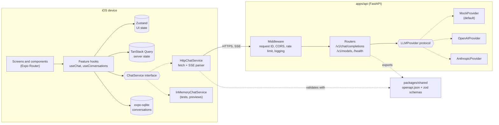
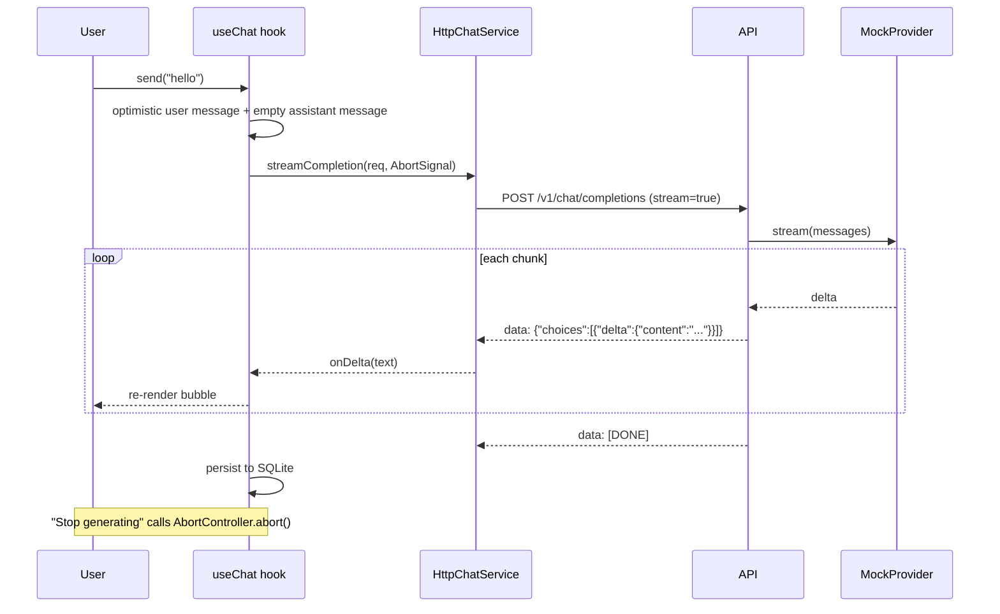

# Architecture

> Status: **scaffolding**. This document describes the target design and is updated as each piece lands.

## System overview

## Packages

| Path              | Responsibility                                                                                                |
| ----------------- | ------------------------------------------------------------------------------------------------------------- |
| `apps/mobile`     | Expo app. Feature folders: `features/chat`, `features/conversations`, `features/models`, `features/settings`. |
| `apps/api`        | FastAPI service. `app/routers`, `app/providers`, `app/schemas`, `app/middleware`.                             |
| `packages/shared` | The single source of the API contract: `openapi.json` (generated by the API) plus zod schemas and TS types.   |

## Key design rules

1. **The contract flows one way.** Pydantic models → `openapi.json` → zod schemas in `packages/shared` → mobile client. CI regenerates the schema and runs `git diff --exit-code` to catch drift.
2. **Dependency injection at both ends.** Mobile code depends on `ChatService`, never on `fetch`. API routes depend on `LLMProvider`, chosen at startup from `LLM_PROVIDER`.
3. **UI components are pure.** They take props and emit callbacks. All side effects live in hooks.
4. **State has one home.** Server state goes in TanStack Query, ephemeral UI state (drawer open, draft text, streaming flag) goes in Zustand, and durable conversations go in SQLite. See [ADR 0001](adr/0001-state-management.md).

## Streaming flow

See [ADR 0003](adr/0003-streaming-sse.md) for why SSE was chosen over WebSockets.

## Configuration

| Variable              | Default                 | Description                             |
| --------------------- | ----------------------- | --------------------------------------- |
| `LLM_PROVIDER`        | `mock`                  | `mock`, `openai`, or `anthropic`        |
| `MOCK_LATENCY_MS`     | `30`                    | Delay between mock chunks               |
| `MOCK_CHUNK_SIZE`     | `4`                     | Characters per mock chunk               |
| `MOCK_SEED`           | `42`                    | Seed for repeatable mock replies        |
| `RATE_LIMIT`          | `60/minute`             | Per-IP limit on completion requests     |
| `CORS_ORIGINS`        | `*`                     | Comma-separated list of allowed origins |
| `EXPO_PUBLIC_API_URL` | `http://localhost:8000` | Base URL the mobile app calls           |
